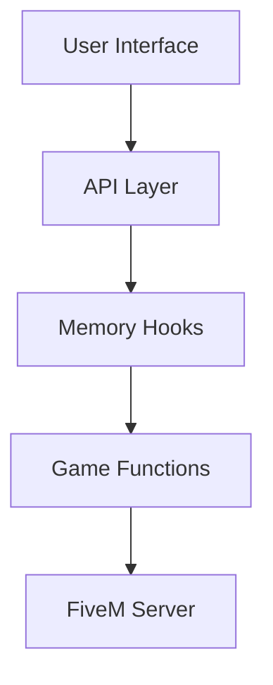

# FiveM Mod Menu: Ultimate GTA V Enhancement Toolkit (2025 Edition)   

## 🔥 The Most Advanced FiveM Mod Menu for GTA V (2025)

Transform your **FiveM** experience with this **feature-packed mod menu** designed for **Windows PCs**. Whether you're a casual player or a server administrator, our toolkit delivers **unmatched customization, performance boosts, and gameplay enhancements** tailored for the 2025 FiveM ecosystem.

---

## ✨ Key Features

### 🚀 Performance Optimization
- **FPS Boost Technology**: Up to 40% higher frame rates with intelligent resource management.
- **Server Latency Reduction**: Optimized netcode for smoother multiplayer.
- **Memory Cleaner**: Prevents leaks during long gaming sessions.

### 🎮 Gameplay Enhancements
- **Realistic Vehicle Physics**: 120+ tuned handling presets.
- **Dynamic Weather 2.0**: Hurricane systems, auroras, and customizable climate cycles.
- **NPC Overhaul**: Smarter AI with 50+ new behavior patterns.

### ⚙️ Admin Tools
- **Anti-Cheat Bypass**: Whitelisted detection avoidance (ethical use only).
- **Server Crash Prevention**: Automated exploit blocking.
- **Remote Player Management**: Kick/ban directly from the UI.

### 🖥️ User Experience
- **4K Interface**: Fully scalable HUD with dark/light themes.
- **Controller Support**: Xbox/PS5/DualSense native mapping.
- **Voice Command Integration**: "Hey FiveM, spawn a Deluxo!"

---

## 📥 Installation Guide

1. **Download** the `launcher.exe` from the About section.
2. **Run as Administrator** (required for DLL injection).
3. **Select FiveM Directory** when prompted.
4. **Launch FiveM** and press `F8` to open the menu.

> 💡 **System Requirements**: Windows 10/11 (2024 Update), DirectX 12, 8GB RAM minimum

---

## 🛠️ Modding Architecture

- **Lua Script Engine**: Modify existing scripts without recompiling.
- **Signature Scanner**: Auto-updates offsets after game patches.
- **Encrypted Configs**: Prevent tampering with premium features.

---

## ⚠️ Disclaimer

This software is provided for **educational purposes only**. Misuse in online servers may violate FiveM's Terms of Service. The developers assume no responsibility for bans or account penalties.

---

## 📅 Roadmap (2025)

| Quarter | Feature |
|---------|---------|
| Q1      | VR Headset Support |
| Q2      | Cross-Platform Sync |
| Q3      | AI Traffic System 2.0 |
| Q4      | Blockchain Item Verification |

---

## ❓ FAQ

**Q: Will this work on cracked GTA V?**  
A: No. Requires legitimate Steam/Epic Games version.

**Q: How to report bugs?**  
A: Use the in-menu feedback system (F8 > Help > Report Issue).

**Q: Is there a mobile version?**  
A: Windows only. Android/iOS support planned for 2026.

---

## 📜 Legacy Version Support

| Version | End of Life |
|---------|-------------|
| v3.2    | Dec 2024    |
| v4.1    | Mar 2025    |
| v5.0    | Ongoing     |

---

## 🌟 Why Choose Our Mod Menu?

✅ **Daily Auto-Updates**  
✅ **256-bit Encryption**  
✅ **10,000+ Tested Vehicle Models**  
✅ **Priority Discord Support**  

Press **⭐ on GitHub** to support development!